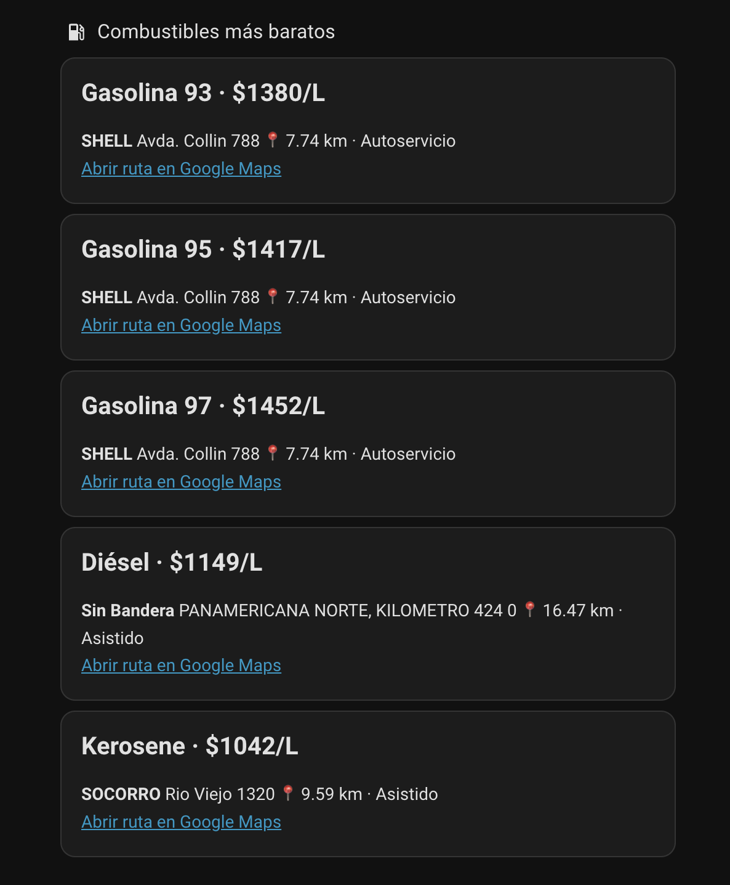
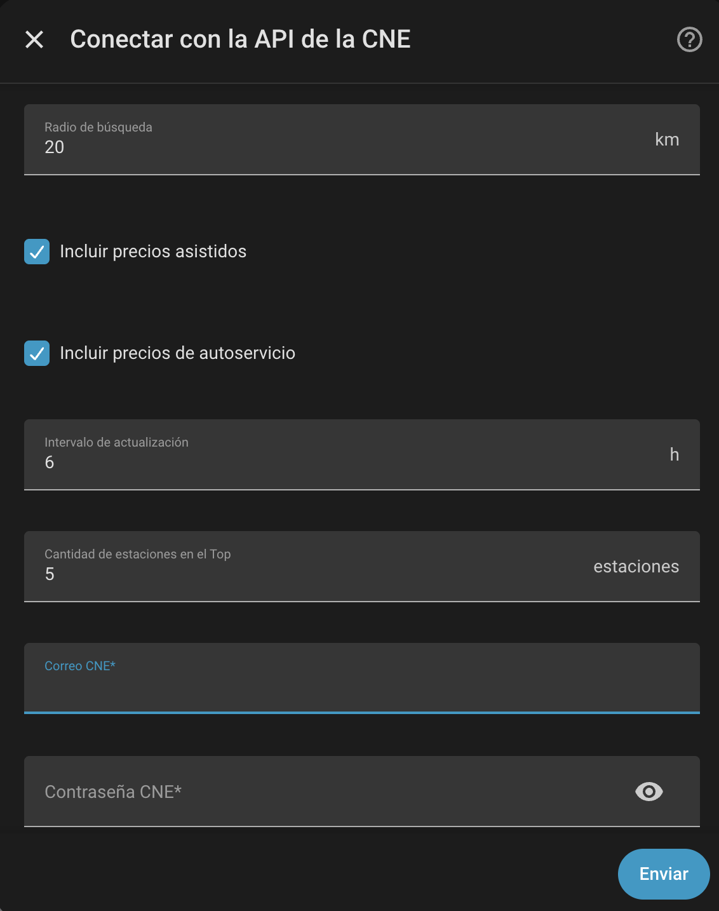

<div align="center">
  

# Chile Combustibles

**Encuentra el combustible más barato cerca de tu ubicación desde Home Assistant.**


</div>



Integración personalizada para Home Assistant que consulta la API oficial de la Comisión Nacional de Energía de Chile (CNE), compara estaciones dentro de un radio configurable y muestra tanto el precio como el lugar donde conviene cargar.

## Qué resuelve

La integración responde directamente estas preguntas:

- ¿Cuál es el precio más bajo para gasolina 93, 95, 97, diésel o kerosene?
- ¿En qué estación está ese precio?
- ¿A qué distancia queda?
- ¿Es autoservicio o atención asistida?
- ¿Cómo llego mediante Google Maps?
- ¿Cuánto podría ahorrar frente a la estación más cercana?

## Características

- Gasolina 93, 95 y 97, diésel y kerosene.
- Precios asistidos y de autoservicio.
- Radio de búsqueda configurable.
- Intervalo de actualización configurable.
- Top configurable de estaciones más baratas por combustible.
- Precio promedio dentro del radio.
- Estación más cercana y cantidad de estaciones detectadas.
- Sensores numéricos para historial y automatizaciones.
- Sensores de recomendación que muestran directamente marca y dirección.
- Enlace directo a Google Maps.
- Costo estimado de llenar el estanque.
- Ahorro estimado frente a la estación más cercana que vende el mismo combustible.
- Renovación automática del token CNE.
- Reautenticación, opciones y diagnósticos desde la interfaz.

## Requisitos

- Home Assistant 2026.3 o posterior.
- HACS.
- Cuenta gratuita en la API CNE.
- Ubicación correctamente configurada en Home Assistant.

## Instalación con HACS

1. Abre **HACS → Integraciones**.
2. En el menú, selecciona **Repositorios personalizados**.
3. Agrega:

   ```text
   https://github.com/mriosriquelme/ha-chile-combustibles
   ```

4. Selecciona la categoría **Integración**.
5. Descarga **Chile Combustibles**.
6. Reinicia Home Assistant.
7. Ve a **Ajustes → Dispositivos y servicios → Añadir integración**.
8. Busca **Chile Combustibles**.

## Configuración



La integración solicita:

| Campo | Descripción |
|---|---|
| Radio de búsqueda | Distancia máxima desde la ubicación de Home Assistant. |
| Precios asistidos | Incluye estaciones con atención de personal. |
| Precios de autoservicio | Incluye precios de autoservicio. |
| Intervalo de actualización | Frecuencia de consulta a la API CNE. |
| Cantidad de estaciones en el Top | Número de alternativas guardadas en los atributos. |
| Capacidad del estanque | Se usa para estimar costo total y ahorro. |
| Correo y contraseña CNE | Credenciales de la cuenta gratuita de la API. |

Las opciones se pueden modificar posteriormente desde **Ajustes → Dispositivos y servicios → Chile Combustibles → Configurar**.

## Sensores

### Sensores de precio

- Gasolina 93 más barata
- Gasolina 95 más barata
- Gasolina 97 más barata
- Diésel más barato
- Kerosene más barato

El estado es numérico en `CLP/L`, por lo que puede usarse en gráficos, historial y automatizaciones.

### Sensores de ubicación

La versión 0.4.0 agrega sensores como:

- Dónde cargar Gasolina 93
- Dónde cargar Gasolina 95
- Dónde cargar Gasolina 97
- Dónde cargar Diésel
- Dónde cargar Kerosene

Su estado muestra directamente:

```text
SHELL · Avda. Collín 788
```

### Otros sensores

- Estación más cercana
- Estaciones en el radio

## Atributos disponibles

Cada sensor de precio incluye, entre otros:

```yaml
brand: SHELL
address: Avda. Collín 788
distance_km: 7.74
service_type: Autoservicio
last_price_update: 2026-07-09 21:51:15
google_maps_url: https://www.google.com/maps/dir/...
average_price: 1391.2
tank_capacity_l: 50
estimated_full_tank_cost: 69000
nearest_station_price: 1392
price_difference_vs_nearest: 12
estimated_savings_full_tank: 600
top_stations: [...]
```

## Dashboard Lovelace

El archivo listo para copiar está en:

```text
dashboard/combustibles.yaml
```

Para agregarlo:

1. Abre un dashboard.
2. Selecciona **Editar dashboard**.
3. Pulsa **Añadir tarjeta → Manual**.
4. Copia el contenido de `dashboard/combustibles.yaml`.
5. Revisa los `entity_id` en **Herramientas de desarrollador → Estados** y ajústalos si fuera necesario.

El dashboard muestra precio, marca, dirección, distancia, tipo de atención, ahorro estimado y acceso a Google Maps.

## Ejemplo de automatización

Notificar cuando la gasolina 95 baje de $1.400:

```yaml
alias: Aviso gasolina 95 barata
triggers:
  - trigger: numeric_state
    entity_id: sensor.cne_combustibles_chile_gasolina_95_mas_barata
    below: 1400
actions:
  - action: notify.mobile_app_sm_s928b
    data:
      title: Gasolina 95 barata
      message: >
        Está a ${{ states('sensor.cne_combustibles_chile_gasolina_95_mas_barata') }}/L
        en {{ state_attr('sensor.cne_combustibles_chile_gasolina_95_mas_barata', 'brand') }},
        {{ state_attr('sensor.cne_combustibles_chile_gasolina_95_mas_barata', 'address') }}.
mode: single
```

## Privacidad

Las credenciales se guardan en la configuración interna de Home Assistant. Los diagnósticos redactan correo, contraseña, coordenadas y enlaces de navegación.

## Fuente de datos

Los datos provienen de la API oficial de la Comisión Nacional de Energía de Chile. Los precios y fechas de actualización dependen de la información reportada por cada estación.

## Roadmap

| Estado | Funcionalidad |
|---|---|
| ✅ | Configuración por interfaz |
| ✅ | Precios más bajos por combustible |
| ✅ | Marca, dirección, distancia y Google Maps |
| ✅ | Top de estaciones en atributos |
| ✅ | Comparación con estación más cercana |
| ✅ | Costo y ahorro estimado por estanque |
| 🚧 | Mapa de estaciones |
| 🚧 | Estaciones favoritas |
| 🚧 | Historial de variaciones de precio |
| 🚧 | Alertas configurables desde la integración |
| 🚧 | Publicación en el catálogo oficial de HACS |

## Licencia

MIT.
