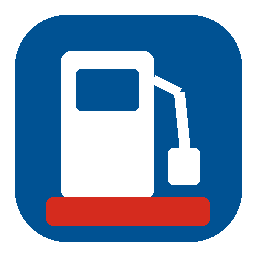

# CNE Combustibles Chile

Integración personalizada para Home Assistant que consulta la API oficial de la Comisión Nacional de Energía (CNE) y expone los precios más bajos de combustibles alrededor de la ubicación configurada en Home Assistant.

## Entidades

- Gasolina 93 más barata
- Gasolina 95 más barata
- Gasolina 97 más barata
- Diésel más barato
- Kerosene más barato
- Estación más cercana

Cada sensor de combustible incluye atributos con marca, dirección, distancia, tipo de atención, fecha de actualización, coordenadas y enlace a Google Maps.

La integración normaliza los códigos de la API:

| Combustible | Asistido | Autoservicio |
|---|---|---|
| Gasolina 93 | `93` | `A93` |
| Gasolina 95 | `95` | `A95` |
| Gasolina 97 | `97` | `A97` |
| Diésel | `DI` | `ADI` |
| Kerosene | `KE` | `AKE` |

## Requisitos

1. Cuenta gratuita en la API CNE.
2. Ubicación correcta configurada en Home Assistant.
3. Home Assistant 2025.6 o posterior.

## Instalación manual

1. Copia `custom_components/cne_combustibles_cl` a `/config/custom_components/cne_combustibles_cl`.
2. Reinicia Home Assistant.
3. Ve a **Ajustes → Dispositivos y servicios → Añadir integración**.
4. Busca **CNE Combustibles Chile**.
5. Ingresa correo y contraseña de la API CNE.

## Instalación mediante HACS

1. En HACS abre **Integraciones → Repositorios personalizados**.
2. Añade este repositorio como tipo **Integración**.
3. Instala la integración y reinicia Home Assistant.

## Configuración

- Radio de búsqueda: 1 a 200 km.
- Incluir precios asistidos.
- Incluir precios de autoservicio.
- Intervalo de actualización: 1 a 24 horas.

El valor predeterminado es 20 km y una actualización cada 6 horas.

## Privacidad

El correo y la contraseña quedan almacenados en la configuración interna de Home Assistant. La integración solicita un token JWT a la CNE y lo mantiene solo en memoria. Si expira, intenta renovarlo automáticamente.

## Fuente de datos

Los datos son publicados por la Comisión Nacional de Energía. Los precios son informados por las estaciones y pueden presentar diferencias respecto del precio disponible al momento de la compra.

## Licencia

MIT

## Dashboard recomendado

El repositorio incluye `dashboard/combustibles_mushroom.yaml`.

1. Instala **Mushroom** desde HACS si aún no lo tienes.
2. Abre el dashboard y selecciona **Editar → Añadir tarjeta → Manual**.
3. Pega el contenido del archivo YAML.
4. Reemplaza los `entity_id` si tu instalación generó nombres diferentes.

Cada tarjeta abre Google Maps al tocarla, usando las coordenadas de la estación con el precio más bajo.

## Recursos de marca

HACS utiliza `brand/icon.png` y `brand/logo.png`. Tras actualizar desde HACS, reinicia Home Assistant y limpia la caché del navegador si el icono anterior continúa apareciendo.
